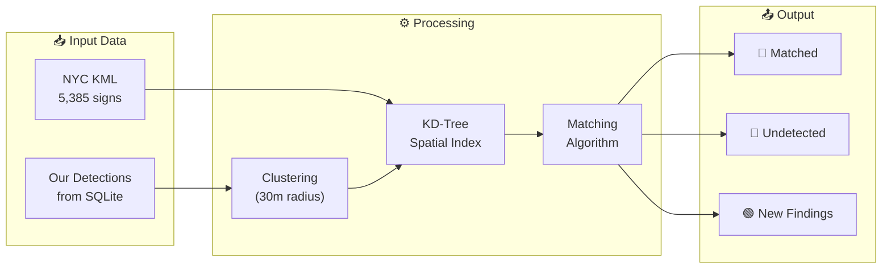
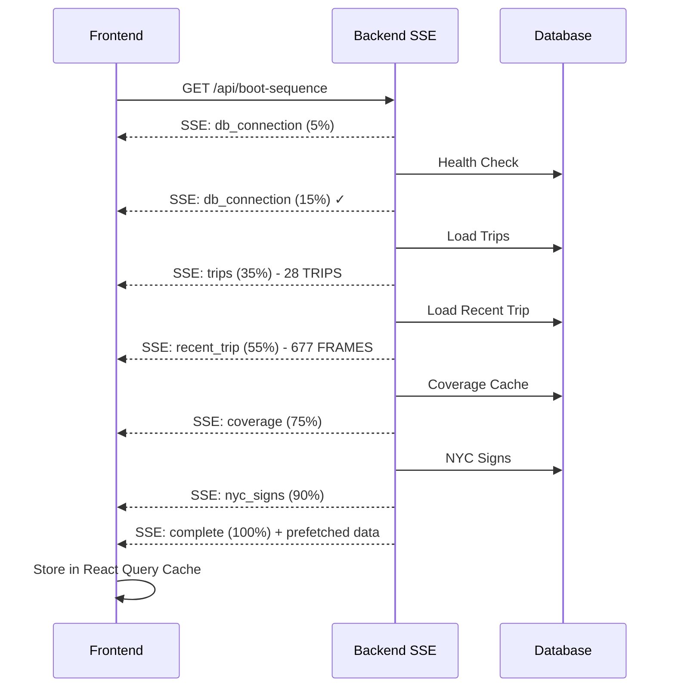
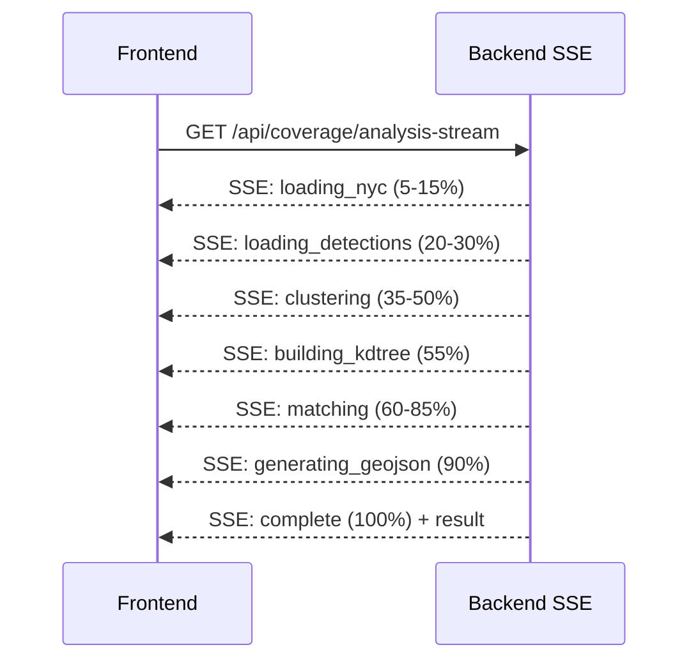
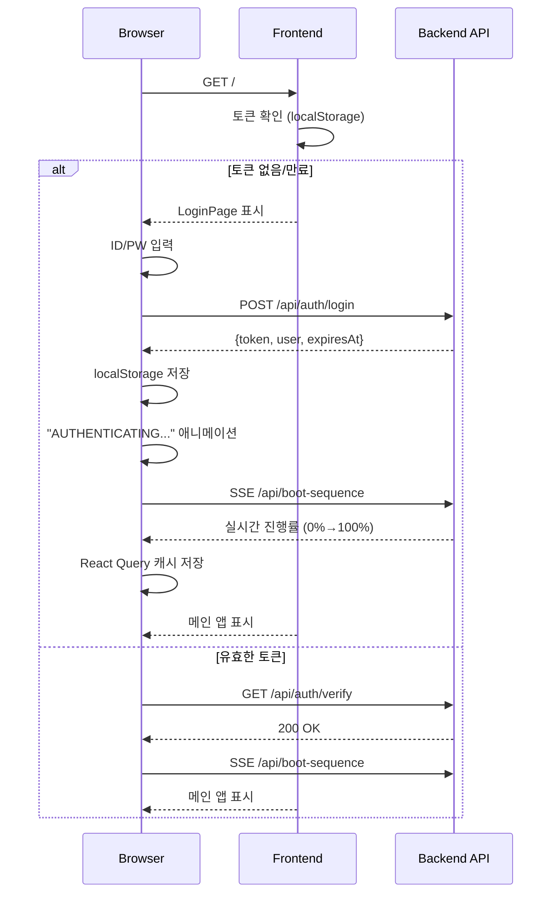
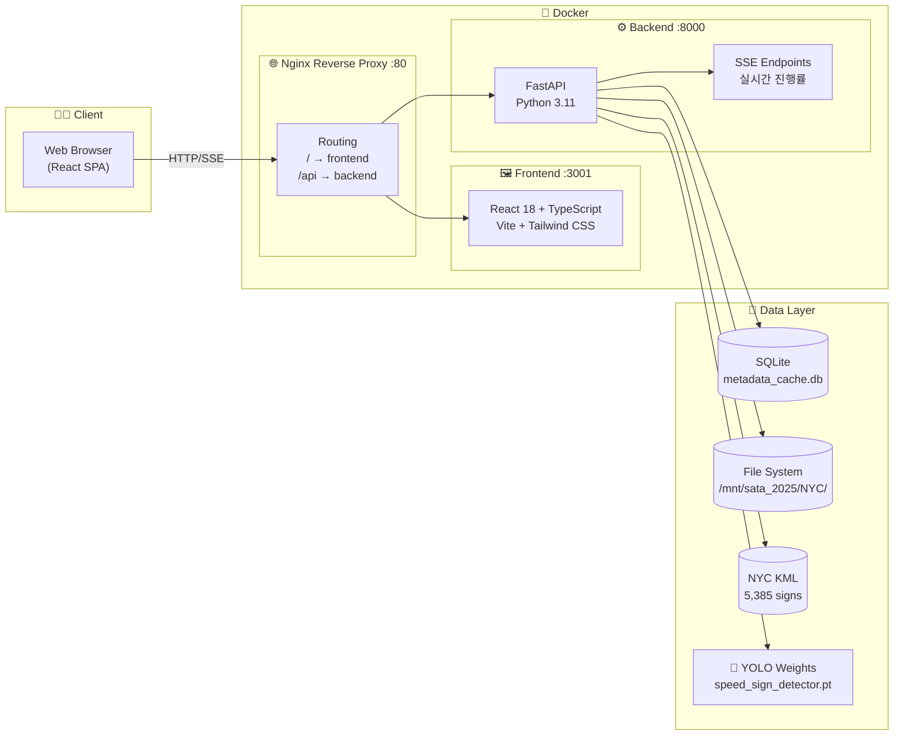
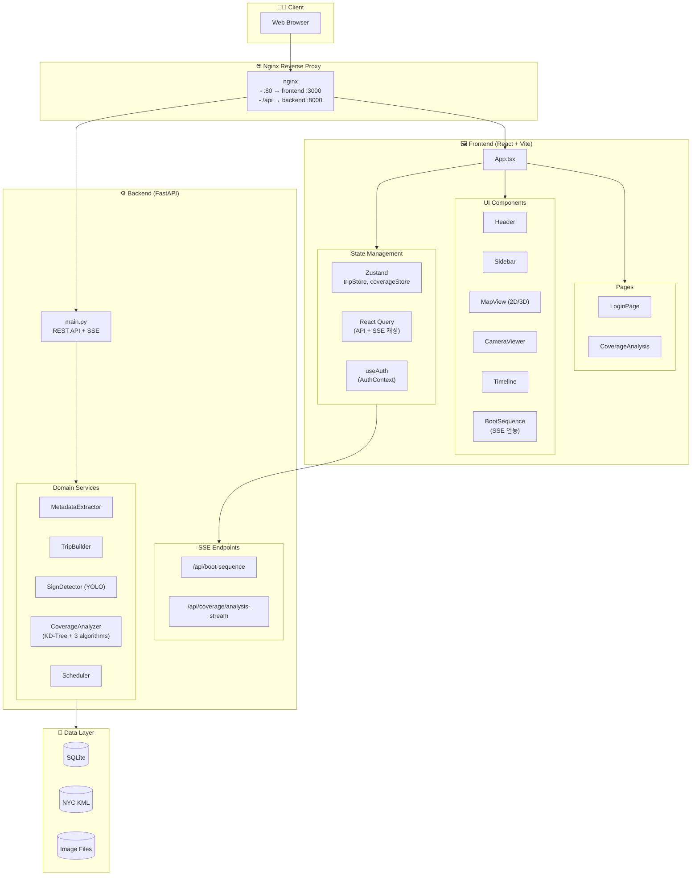
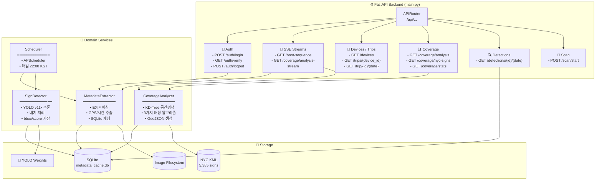
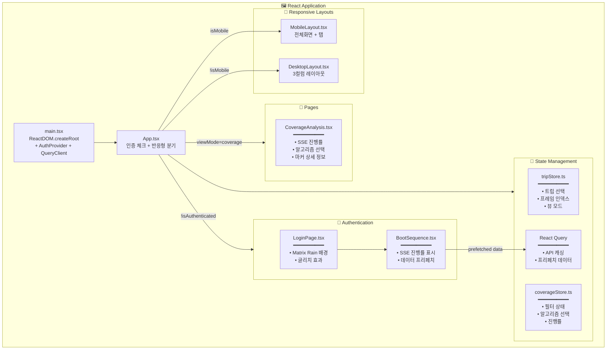
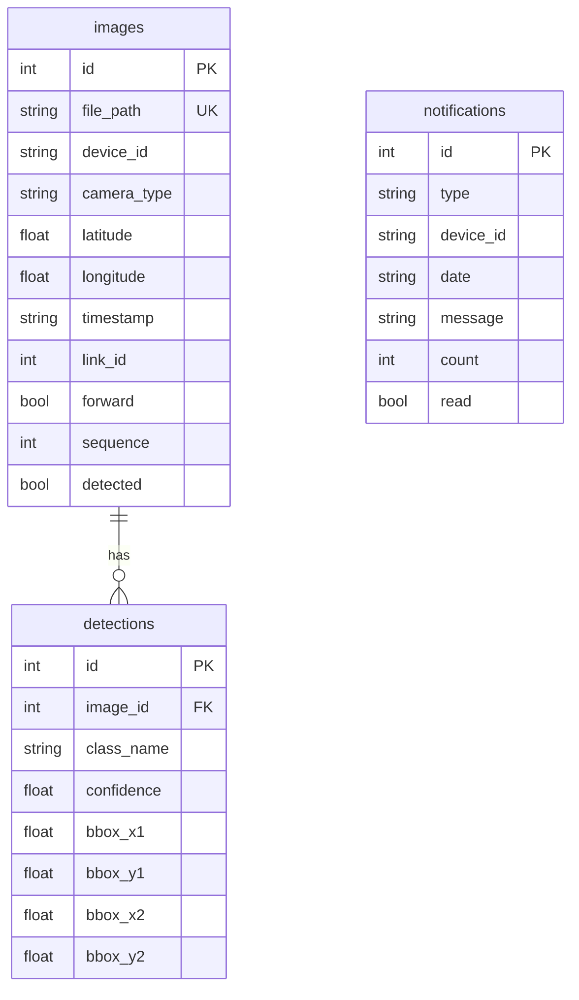

# 🚗 NYC Vehicle Surveillance System

NYC 차량 감시 시스템 - 차량 카메라로 수집된 이미지 데이터를 지도에서 시각화하고, AI(YOLO)로 속도 제한 표지판을 검출하는 풀스택 웹 애플리케이션입니다.

## ✨ 주요 기능

| 기능 | 설명 |
|------|------|
| 🗺️ **차량 경로 추적** | 2D/3D 맵에서 GPS 기반 경로 시각화 (MapLibre GL + Deck.gl) |
| 📷 **카메라 뷰어** | 경로를 따라 촬영된 이미지 재생 및 타임라인 |
| 🚦 **속도 표지판 감지** | YOLOv11x 모델로 속도 제한 표지판 탐지 |
| 📊 **Coverage 분석** | NYC 공식 DB vs 감지 데이터 비교, 3가지 매칭 알고리즘 |
| 💾 **메타데이터 캐싱** | EXIF 데이터에서 GPS/시간 정보 추출 및 SQLite 저장 |
| ⏰ **스케줄러** | 매일 자동 데이터 스캔 |
| 🔀 **멀티 트립 오버레이** | 여러 트립을 한 지도에 비교 표시 |
| 📱 **반응형 UI** | 모바일/데스크톱 자동 감지, 전용 레이아웃 |
| 🚗 **드라이빙 모드** | 자동 재생 + 헤딩업 방식 지도 회전 |
| 🔐 **접근 제어** | 커스텀 사이버펑크 테마 로그인 페이지 |
| 🚀 **SSE 실시간 진행률** | 부팅/분석 시 실시간 프로그레스 표시 |

---

## 📊 Coverage Analysis (신규 기능)

NYC 공식 속도제한 표지판 데이터베이스(KML)와 시스템이 감지한 표지판을 비교 분석합니다.

### 기능 개요
- **매칭 분석**: NYC DB 5,385개 표지판 vs 시스템 감지 데이터
- **3가지 마커 타입**: 매칭됨(파란색), 미감지(빨간색), 신규 발견(녹색)
- **실시간 진행률**: SSE 기반 분석 진행률 표시 (0% → 100%)
- **KD-Tree 최적화**: O(N log M) 복잡도로 빠른 공간 검색

### 매칭 알고리즘 선택

| 알고리즘 | 특징 | 복잡도 |
|----------|------|--------|
| **Greedy Nearest** | 빠름, NYC 순회하며 최근접 선택 | O(N×M) |
| **Hungarian** | 전역 최적, 1:1 매칭 보장 | O(N³) |
| **Mutual Nearest** | 보수적, 양방향 최근접만 매칭 | O(N×M) |

### Coverage Analysis 플로우



---

## 🚀 SSE 기반 실시간 진행률

### Boot Sequence (부팅 시퀀스)

로그인 후 실제 데이터를 프리페치하면서 진행률을 표시합니다.



### Coverage Analysis SSE



---

## 📱 모바일 지원

모바일 디바이스에서 최적화된 UI를 제공합니다.

### 레이아웃 비교

| 데스크톱 | 모바일 |
|----------|--------|
| 3컬럼 레이아웃 (사이드바 + 맵 + 패널) | 전체화면 맵 + 바텀시트 |
| 풀 HUD 오버레이 | 최소화된 컴팩트 HUD |
| 키보드 단축키 | 터치 제스처 |

### 모바일 UI 구조

```
┌─────────────────────────┐
│  Mini Header (축소형)    │
├─────────────────────────┤
│                         │
│    전체화면 지도         │
│    (컴팩트 HUD)          │
│                         │
├─────────────────────────┤
│  Timeline (재생 컨트롤)  │
├─────────────────────────┤
│  Tab Bar                │
│  [지도] [카메라] [정보]  │
└─────────────────────────┘
```

### 드라이빙 모드
- ▶️ 재생 버튼으로 자동 프레임 전환
- 속도 조절: 1×, 2×, 4×
- 헤딩업(Heading-Up) 모드: 진행 방향이 항상 위쪽

---

## 🔐 인증 시스템



### API 엔드포인트
| Method | Endpoint | 설명 |
|--------|----------|------|
| `POST` | `/api/auth/login` | 로그인 (ID/PW → 토큰 발급) |
| `GET` | `/api/auth/verify` | 토큰 검증 |
| `POST` | `/api/auth/logout` | 로그아웃 (토큰 무효화) |

### 관련 파일
| 파일 | 설명 |
|------|------|
| `frontend/src/pages/LoginPage.tsx` | 로그인 UI + Matrix Rain 배경 |
| `frontend/src/hooks/useAuth.tsx` | 인증 상태 관리 (Context API) |
| `frontend/src/components/ui/BootSequence.tsx` | SSE 연동 부팅 시퀀스 |
| `frontend/src/components/LogoutConfirmModal.tsx` | 로그아웃 확인 모달 |
| `backend/main.py` | 인증 API + Boot SSE 엔드포인트 |

---

## 🏗️ 시스템 아키텍처

### 1. 전체 시스템 아키텍처



### 2. 상세 아키텍처 (컴포넌트 레벨)



---

## ⚙️ 백엔드 아키텍처



---

## 🖼️ 프론트엔드 아키텍처



---

## 📁 디렉토리 구조

```
nyc-vehicle-tracker/
├── 📂 backend/
│   ├── main.py                    # FastAPI 진입점 + SSE 엔드포인트
│   ├── requirements.txt           # Python 의존성
│   ├── Dockerfile
│   ├── 📂 data/
│   │   ├── metadata_cache.db      # SQLite 캐시
│   │   └── nyc_sls_2025-10-24.kml # NYC 표지판 KML
│   ├── 📂 models/
│   │   └── speed_sign_detector.pt # YOLO 모델
│   └── 📂 services/
│       ├── metadata_extractor.py  # EXIF 파싱
│       ├── trip_builder.py        # GeoJSON 생성
│       ├── sign_detector.py       # YOLO 탐지
│       ├── kml_parser.py          # NYC KML 파싱
│       ├── coverage_analyzer.py   # KD-Tree + 매칭 알고리즘
│       ├── scheduler.py           # 일일 스캔
│       └── download_watcher.py    # S3 다운로드 감시
│
├── 📂 frontend/
│   ├── package.json
│   ├── vite.config.ts
│   ├── tailwind.config.js
│   ├── Dockerfile
│   └── 📂 src/
│       ├── App.tsx                # 인증 + 반응형 분기
│       ├── main.tsx               # 진입점 + Providers
│       ├── 📂 pages/
│       │   ├── LoginPage.tsx      # 커스텀 로그인 + Matrix Rain
│       │   └── CoverageAnalysis.tsx # Coverage 분석 페이지
│       ├── 📂 layouts/
│       │   ├── DesktopLayout.tsx
│       │   └── MobileLayout.tsx
│       ├── 📂 components/
│       │   ├── Header.tsx
│       │   ├── Sidebar.tsx
│       │   ├── Map2D.tsx / Map3D.tsx
│       │   ├── CameraViewer.tsx
│       │   ├── 📂 ui/
│       │   │   ├── BootSequence.tsx   # SSE 부팅 시퀀스
│       │   │   └── ...
│       │   └── 📂 mobile/
│       ├── 📂 stores/
│       │   ├── tripStore.ts
│       │   └── coverageStore.ts   # Coverage 상태 관리
│       ├── 📂 hooks/
│       │   ├── useAuth.tsx        # 인증 Context
│       │   └── useMediaQuery.ts
│       └── 📂 styles/
│
├── 📂 nginx/
│   ├── nginx.conf
│   └── Dockerfile
│
├── docker-compose.yml
├── Makefile
└── README.md
```

---

## 🚀 Quick Start

### 개발 모드

```bash
# 의존성 설치
make setup

# 개발 서버 실행
make dev
```

### Docker 배포

```bash
# 빌드
make build

# 실행
make start

# 로그 확인
make logs

# 중지
make stop
```

### 수동 실행

```bash
# Backend
cd backend
pip install -r requirements.txt
uvicorn main:app --reload --port 8000

# Frontend
cd frontend
npm install
npm run dev
```

---

## 🛠️ 기술 스택

### Backend
| 기술 | 용도 |
|------|------|
| **Python 3.11** | 런타임 |
| **FastAPI** | REST API + SSE 스트리밍 |
| **SQLite** | 메타데이터 캐싱 |
| **scipy.spatial.cKDTree** | 공간 검색 최적화 |
| **scipy.optimize** | Hungarian 알고리즘 |
| **Pillow** | EXIF 데이터 추출 |
| **PyTorch + Ultralytics** | YOLO v11x 추론 |
| **APScheduler** | 일일 스케줄링 |

### Frontend
| 기술 | 용도 |
|------|------|
| **React 18** | UI 프레임워크 |
| **TypeScript** | 타입 안전성 |
| **Vite** | 빌드 도구 |
| **Tailwind CSS** | 스타일링 |
| **MapLibre GL** | 2D 지도 |
| **Deck.gl** | 3D 시각화 |
| **Zustand** | 상태 관리 |
| **TanStack Query** | 서버 상태 + 캐싱 |
| **EventSource** | SSE 실시간 스트림 |

### Infrastructure
| 기술 | 용도 |
|------|------|
| **Docker** | 컨테이너화 |
| **Docker Compose** | 오케스트레이션 |
| **Nginx** | 리버스 프록시 |

---

## 📡 API Endpoints

### 인증
| Method | Endpoint | 설명 |
|--------|----------|------|
| `POST` | `/api/auth/login` | 로그인 |
| `GET` | `/api/auth/verify` | 토큰 검증 |
| `POST` | `/api/auth/logout` | 로그아웃 |

### SSE 스트림
| Method | Endpoint | 설명 |
|--------|----------|------|
| `GET` | `/api/boot-sequence` | 부팅 시퀀스 진행률 |
| `GET` | `/api/coverage/analysis-stream` | Coverage 분석 진행률 |

### 데이터
| Method | Endpoint | 설명 |
|--------|----------|------|
| `GET` | `/api/health` | 헬스 체크 |
| `GET` | `/api/devices` | 디바이스 목록 |
| `GET` | `/api/trips/{device_id}` | 트립 목록 |
| `GET` | `/api/trip/{device_id}/{date}` | 트립 상세 |
| `GET` | `/api/trip/{device_id}/{date}/3d` | 3D 경로 데이터 |
| `GET` | `/api/image/...` | 이미지 서빙 |
| `GET` | `/api/detections/{device_id}/{date}` | YOLO 탐지 결과 |

### Coverage 분석
| Method | Endpoint | 설명 |
|--------|----------|------|
| `GET` | `/api/coverage/analysis` | Coverage 분석 (radius, algorithm 파라미터) |
| `GET` | `/api/coverage/nyc-signs` | NYC KML 데이터 |
| `GET` | `/api/coverage/stats` | Coverage 통계 |

---

## 📊 데이터베이스 스키마



---

## 📜 License

MIT License

---

## 👥 Contributors

- **Daree** - Initial development
